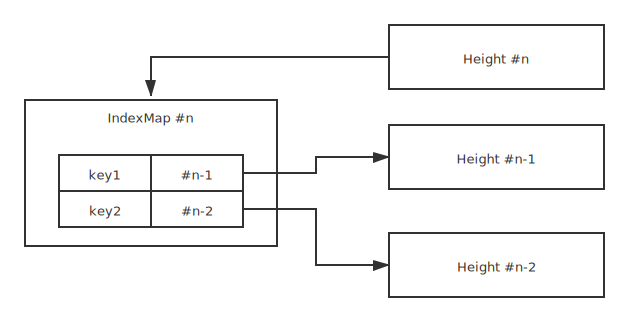

# bs3

Blockchain simple state storage.

## Features (WIP)

- [ ] Stateless: Data in this storage don't affect block.
- [ ] Stateful: Data in this storage will affect block.
- [X] Transaction based on cache.
  - [X] Force sync state to lastest success transaction. (For `check_tx`)
  - [X] Commit transaction for success transaction. (For `deliver_tx`)
  - [X] Revert transaction for failed transaction. (For `deliver_tx`)
- [X] Snapshot based on CoW for each block.
  - [X] Load snapshot from any height to recover node.
  - [X] Rollback snapshot.
  - [X] Read any height snapshot.
  - [ ] Use snapshot to compute world state and compute merkle root.
- [X] Support multi-type of backend.
  - [X] Store trait.
  - [ ] Sled backend.
  - [ ] Memory backend.
- [X] 100% compact `BTreeMap<Output<D>, Vec<u8>>`.
- [ ] Testing
  - [ ] Basic usage
  - [ ] Logic
  - [ ] Benchmark

## Design

### Backend Requirement

- get value by key.
- batch execute.

### Stateless

Stateless storage has interface same as `BTreeMap`.

If the data in the storage wants to be calculated correctly,
it must be calculated from the first block to ensure that all transactions are executed in order.

### Stateful

Stateful store's API is same as Stateless store, only add one API:

``` rust
pub trait Stateful<D: Digest>: Stateless<D> {
    fn root(&self) -> Output<D>;
}
```

`bs3` compute merkle when you call `root` method.

Stateful's behavier related to `Snapshot`.

### Transaction

> Transaction often use for compute blockchain transaction.

Transaction implement by `BTreeMap` cache.

### Snapshot

- Block height `n`'s snapshot is state diff of height `n-1` between `n`. If `n == 0` mean no state.
- Each height have a index map, this map use to find which snapshot have this data.
  - This link refer to closer height less than itself.

You will get number of snapshot(height), when the bs3 snapshot the current state's data,
and then compute this module's state Merkle root hash. If you return errors in `BeginBlock`, `EndBlock`, and `Commit`
in the ABCI interface, the bs3 can rollback automatically.



